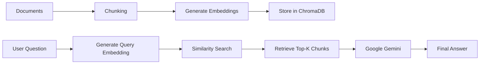

<div align="center">

# 🤖 RAG Chatbot

### Retrieval-Augmented Generation (RAG) Chatbot using Python, Google Gemini & ChromaDB

A modular AI chatbot that retrieves relevant information from a vector database before generating responses with Google Gemini, enabling accurate and context-aware answers.


</div>

---

# 📖 Overview

Large Language Models (LLMs) generate powerful responses but can sometimes produce incorrect or fabricated information.

This project implements **Retrieval-Augmented Generation (RAG)**, where relevant information is first retrieved from a custom knowledge base and then supplied to the language model before generating the final answer.

This significantly improves response quality while reducing hallucinations.

---

# ✨ Features

- 📄 Document Embedding
- 🧠 Semantic Search
- 🗂️ ChromaDB Vector Database
- 🤖 Google Gemini Integration
- 🔍 Similarity Search
- 🏷️ Metadata Support
- 🧩 Modular Python Architecture
- 🔐 Environment Variable Support
- ⚡ Easy to Extend

---

# 🛠️ Tech Stack

| Category | Technology |
|-----------|------------|
| Language | Python |
| LLM | Google Gemini |
| Vector Database | ChromaDB |
| Embedding Model | Gemini Embedding API |
| Environment | python-dotenv |

---

# 🏗️ System Architecture



---

# 📂 Project Structure

```
RAG-chatbot/
│
├── chatbot.py
├── config.py
├── embedding.py
├── retrieval.py
├── vectordb.py
├── main.py
│
├── data/
│   └── documents/
│
├── chroma_db/
│
├── .env
├── requirements.txt
└── README.md
```

---

# 🚀 Installation

### Clone the Repository

```bash
git clone https://github.com/balakoyyamani/RAG-chatbot.git

cd RAG-chatbot
```

### Install Dependencies

```bash
pip install -r requirements.txt
```

---

# 🔑 Environment Variables

Create a `.env` file inside the project directory.

```env
GOOGLE_API_KEY=YOUR_API_KEY
```

---

# ▶️ Run the Application

```bash
python main.py
```

---

# 🔄 Workflow

```
                    User Question
                          │
                          ▼
              Convert Query to Embedding
                          │
                          ▼
               Semantic Similarity Search
                          │
                          ▼
            Retrieve Relevant Document Chunks
                          │
                          ▼
             Send Context + Question to Gemini
                          │
                          ▼
                  Generate Final Answer
```

---

# 💬 Example

### User

```
What is Retrieval-Augmented Generation?
```

### Process

```
Question

↓

Embedding

↓

Vector Search

↓

Retrieve Context

↓

Gemini

↓

Answer
```

### Response

```
Retrieval-Augmented Generation (RAG) combines
information retrieval with language generation by
fetching relevant documents before generating the
final response.
```

---

# 📚 Learning Outcomes

Through this project, I gained hands-on experience with:

- Retrieval-Augmented Generation (RAG)
- Embeddings
- Vector Databases
- Semantic Search
- Google Gemini API
- Prompt Engineering
- Metadata Handling
- Modular Python Development

---

# 📈 Future Improvements

- 🌐 Flask Web Interface
- 📄 PDF Upload Support
- 📚 Multiple Knowledge Bases
- 💬 Conversation Memory
- 🔍 Hybrid Search
- 🚀 REST API
- 🐳 Docker Support
- 👤 Authentication
- 📊 Admin Dashboard

---

# 📊 Project Status

| Module | Status |
|----------|:------:|
| Embedding Pipeline | ✅ |
| ChromaDB Integration | ✅ |
| Retrieval Pipeline | ✅ |
| Gemini Integration | ✅ |
| Metadata Support | ✅ |
| Flask UI | 🚧 |
| REST API | 📅 |
| Docker Deployment | 📅 |

---

# 📸 Screenshots

> Screenshots will be added after the Flask interface is completed.

---

# 🤝 Contributing

Contributions, suggestions, and improvements are welcome.

Feel free to fork this repository and submit a pull request.

---

# 📜 License

This project is licensed under the MIT License.

---

<div align="center">

# 👨‍💻 Author

## **Balachandar Koyyamani**

💼 LinkedIn  
https://www.linkedin.com/in/balakoyyamani/

💻 GitHub  
https://github.com/balakoyyamani

📧 Email  
balakoyyamani@gmail.com

---

### ⭐ If you found this project useful, please consider giving it a Star!

</div>